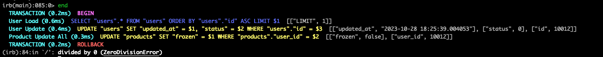
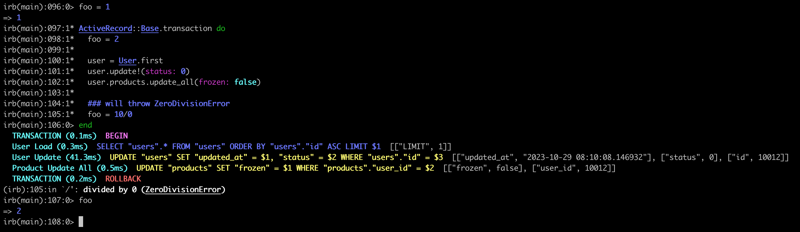

What is transaction?

Transaction is the smallest non-dividable piece of code. It can be described as the entity which we cannot be modularised again into smaller modules such that it will be run in a binary form - either it is executed completely or it is not executed at all.

In terms of business logic, transaction can be described as a group of few operations which are necessarily need to be performed together at all cost. Let's try to understand through an example. In digital banking a transfer of money would be successful only if the money is debited from the sender's account and same amount of money is credited into receiver's bank account. The transaction would be incomplete if any of these two statements are not successful.


How transactions are implemented rails?

ActiveRecord has a method called 'transaction' which can be called like below space - 
```ruby
ActiveRecord::Base.transaction do 
  code block 
end
``` 
As this is an ActiveRecord implementation, it ensures every write or update to the database is either completely committed or none of the database updates are committed.


<h3>Let's see through an example.</h3>


```ruby
ActiveRecord::Base.transaction do 
  user = User.first
  user.update!(status: 1)
  user.products.update_all(frozen: true) 
end
```

Here we are trying to update the `User` and associated `Product` records in the database and these are wrapped inside a transaction. The console log for this code will be like this -


<h3>Now</h3> let's try to play with transaction block. As we previously said it will either save all changes or will not save any change. Let's test it.

For this use case we will need a code which will throw an error and causes unsuccessful completion of code. We can make use of divide by 0 exception by simply putting a statement without complicating it. Here is how the updated code block will look like -


```ruby
ActiveRecord::Base.transaction do 
  user = User.first
  user.update!(status: 0)
  user.products.update_all(frozen: false)

  ### will throw ZeroDivisionError
  foo = 10/0
end
```
Let's try to execute this code block. And here is the result -



As you can see from the bottom of the log, this code has thrown divided by zero exception and as a result of which, database has rolled back the transaction. Meaning both the updates first to the `users` table and second to the `products` table are not saved to the database. So both the tables users and products are now at the same state they were before running the transaction block.


<h3>Curious about foo? Variable vs DB save?</h3>

What happens to the value of foo? As it is not a database entity but a simple local very able how transaction deals with it? Let's find out.

```ruby
foo = 1
ActiveRecord::Base.transaction do 
  foo = 2

  user = User.first
  user.update!(status: 0)
  user.products.update_all(frozen: false)

  ### will throw ZeroDivisionError
  foo = 10/0
end
foo
```

Let's try to execute this code block. And here is the result -



Here you can see the value of food is equal to last update value within the transaction block. Foo has not rolled back its value to pre-transaction block value. By this example we can conclude local variable values are not ruled back even if transaction fails.


Happy Coding!!!


---
References - 
 
- [keywords in Ruby](https://railsexamples.com/keywords-in-ruby/)
